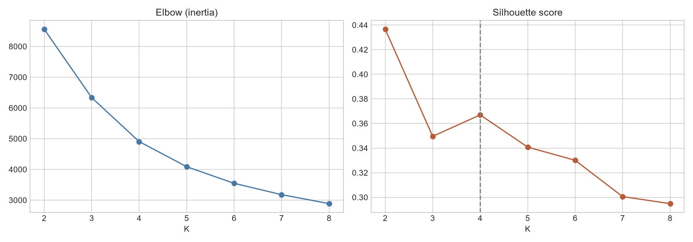
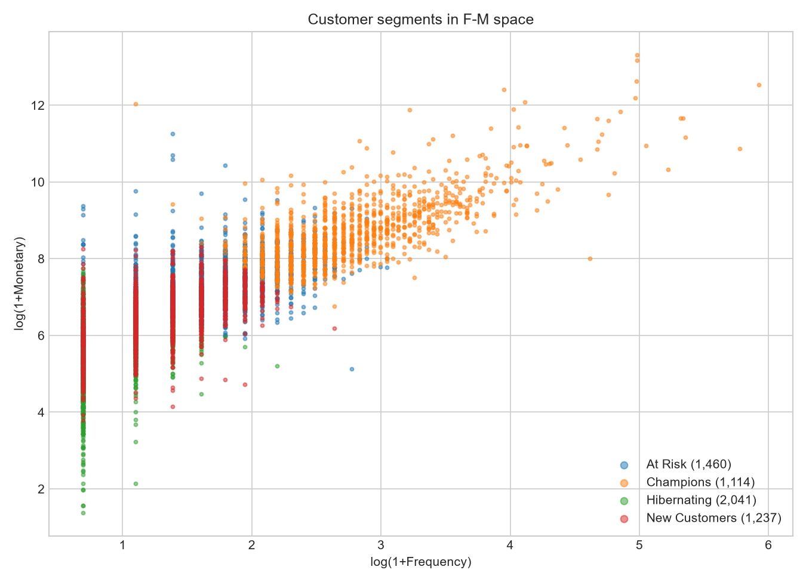

# 🛍️ Customer Segmentation + BI Dashboard

RFM segmentation of **Online Retail II** (UCI) — real UK e-commerce invoices,
Dec 2009 – Dec 2011 — with an interactive **Power BI dashboard as the
deliverable**. All customer features are built from 1.07M raw invoice lines;
nothing is pre-aggregated.

## Business framing

Not all customers deserve the same marketing dollar. Segmentation turns one
undifferentiated customer file into named audiences with obvious actions:
protect the **Champions** who fund the business, win back **At Risk**
customers while they still remember you, nurture **New Customers** toward
loyalty, and stop spending on **Hibernating** accounts that won't return.
Here that logic is stark: **19% of customers (Champions) produce 71.8% of
revenue**.

## The segments (K-Means on log-RFM, K=4)

| Segment | Customers | Share | Avg Recency | Avg Frequency | Avg Spend | Revenue Share |
|---|---|---|---|---|---|---|
| **Champions** | 1,114 | 19.0% | 25 days | 19.8 orders | $11,230 | **71.8%** |
| **At Risk** | 1,460 | 24.9% | 209 days | 5.4 | $2,177 | 18.2% |
| **New Customers** | 1,237 | 21.1% | 28 days | 3.0 | $837 | 5.9% |
| **Hibernating** | 2,041 | 34.9% | 394 days | 1.4 | $348 | 4.1% |

## Methodology (and the choices that matter)

- **Cleaning is documented, not silent** — cancelled invoices (−19,494),
  non-positive qty/price (−6,207), missing CustomerID (−236,121: anonymous
  till sales can't be segmented), non-product codes like POST/fees (−2,915).
  75.2% of rows kept; every drop counted in `01_data_cleaning.ipynb`.
- **RFM built from raw invoices** as of the day after the last transaction,
  plus behavior features that separate this from a tutorial: avg order value,
  **inter-purchase variability** (regular vs sporadic buyers), **product
  diversity**, tenure.
- **Log-transform before K-Means** — Frequency/Monetary are heavily
  right-skewed; without `log1p`, a few wholesale whales dominate every
  Euclidean centroid (a commonly skipped step, shown explicitly in
  `02_rfm_feature_engineering.ipynb`).
- **K chosen from the data, not tradition**: K=2 wins raw silhouette but only
  separates active/inactive (useless to marketing). Among non-trivial K≥3,
  silhouette has a clear **local maximum at K=4** (0.367), which also sits in
  the elbow region — the full argument with both plots is in
  `03_clustering.ipynb`. Hierarchical clustering was evaluated and rejected
  (no added structure, less interpretable centroids).




## The dashboard — Cluster Intelligence (`dashboard/SegmentationExplorer/`)


This is a **clustering** dashboard, not a sales dashboard: every page answers a
question a segmentation owner has to defend in a room.

| Page | What it answers |
|---|---|
| **Cluster Anatomy** | *Are these four clusters real?* Silhouette-by-K and the inertia elbow (with K=2 shown and rejected), per-cluster cohesion, and the **centroid fingerprint** — each cluster's centre in standardized log-RFM, so you can read what defines it |
| **Cluster Space** | *Where does each customer sit?* All 5,852 customers plotted in the exact space K-Means optimized in (standardized log-RFM), bubble-sized by lifetime value, plus boundary-margin vs value — the top-right corner is valuable *and* unstable |
| **Cluster Geography** | *Where does each cluster live?* Filled map of lifetime revenue by country, a bubble map whose slices show each country's **cluster mix**, champion density, and a country × cluster matrix |
| **Boundary Watch** | *Who is about to change cluster, and what is it worth?* A drift map (current cluster vs nearest rival centroid), value-at-stake by segment, and a ranked call list — **1,735 customers (29.6%) sit on a boundary, carrying $3.81M in lifetime value** |

The extra columns that make this possible are computed by
`src/export_cluster_diagnostics.py`, straight from the fitted model: each
customer's silhouette, distance to its own centroid, distance to the nearest
rival centroid, the resulting boundary margin, and which cluster it would join
next.

Interactivity: segment / cohesion / country slicers on every page, full
cross-filtering, and a star-schema model. The maps read the customer table
directly (rather than a pre-rolled country table) so a segment slicer
re-filters the geography exactly like every other visual.

Open `SegmentationExplorer.pbip` in Power BI Desktop — the model loads five
small CSVs (< 1 MB total, all committed), so it opens with data already in
place; no refresh step, no 92 MB transaction file.

## Repo tour

```
notebooks/  01_data_cleaning -> 02_rfm -> 03_clustering -> 04_segment_profiling  (executed)
src/        rfm.py, clustering.py, export_for_bi.py, export_cluster_diagnostics.py
dashboard/  SegmentationExplorer PBIP project + cluster-diagnostic CSV extracts
```

## Reproduce

```bash
python -m venv venv && venv\Scripts\pip install -r requirements.txt
python -m src.rfm            # clean 1.07M rows -> RFM features
python -m src.clustering     # K selection -> K-Means -> named segments
python -m src.export_for_bi  # flat tables for the dashboard
```
