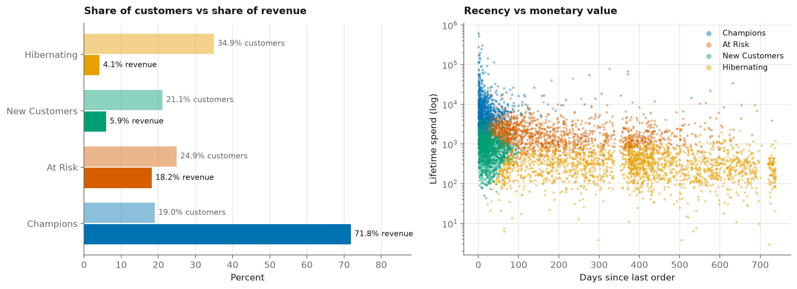
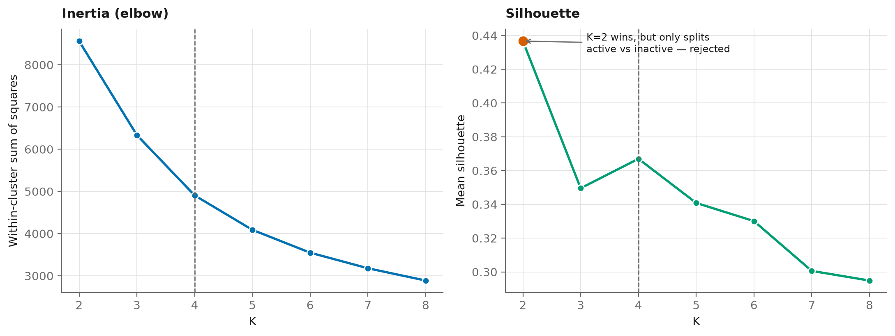
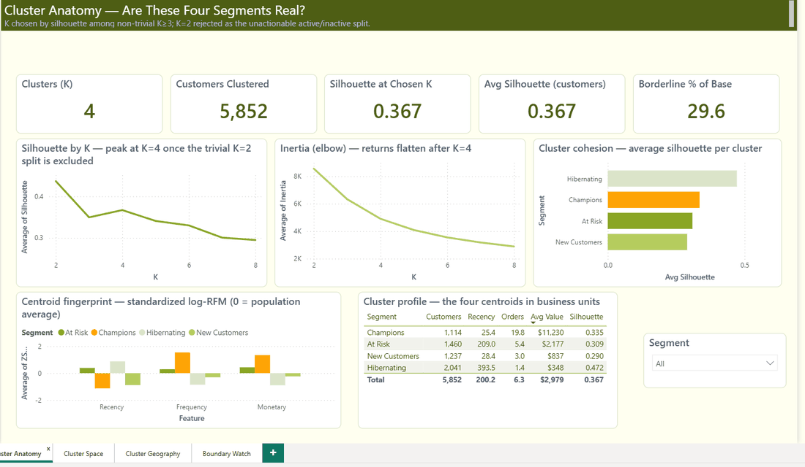

# Customer Segmentation on Online Retail II

RFM segmentation of a UK online retailer's invoices, with a Power BI report as the
deliverable.

**[→ Read the analysis](customer_segmentation.ipynb)** — one self-contained notebook.

## 🚢 Published

[](https://github.com/Yahya-osama-mohmamed/customer-segmentation/actions/workflows/ci.yml)
[](https://github.com/Yahya-osama-mohmamed/customer-segmentation/actions/workflows/pages.yml)

The executed analysis is published at **https://yahya-osama-mohmamed.github.io/customer-segmentation/** — rebuilt by GitHub Actions on every push.

There is no container here: nothing in this repo is a service, and wrapping a
web shell around an analysis to have something to deploy would be inventing a
product that does not exist. The analysis is the deliverable.

---

Which customers are worth spending marketing money on, and which aren't?

The answer here is stark: **19% of customers produce 72% of revenue**. That's the whole
case for segmenting — it turns one undifferentiated customer file into four audiences with
different and obvious actions.

## Data

[Online Retail II](https://archive.ics.uci.edu/dataset/502/online+retail+ii) (UCI) —
1,067,371 invoice lines from a UK online retailer, Dec 2009 to Dec 2011. Every customer
feature is built from those raw lines; nothing is pre-aggregated.

Cleaning drops a quarter of the rows, and each drop is counted rather than done quietly:
cancelled invoices (−19,494), non-positive quantity or price (−6,207), missing CustomerID
(−236,121), and non-product codes like postage and fees (−2,915). Almost all of it is the
anonymous till sales — real revenue, but no customer to attribute it to.

That leaves **5,852 customers**.

## The segments

| Segment | Customers | Share | Avg recency | Avg orders | Avg spend | Revenue share |
|---|---|---|---|---|---|---|
| Champions | 1,114 | 19.0% | 25 days | 19.8 | $11,230 | **71.8%** |
| At Risk | 1,460 | 24.9% | 209 days | 5.4 | $2,177 | 18.2% |
| New Customers | 1,237 | 21.1% | 28 days | 3.0 | $837 | 5.9% |
| Hibernating | 2,041 | 34.9% | 394 days | 1.4 | $348 | 4.1% |



## Two choices that matter

**The log transform isn't optional.** Frequency and monetary value are heavily
right-skewed — a few wholesale buyers spend a hundred times the typical customer. K-Means
minimises squared Euclidean distance, so without `log1p` those whales drag every centroid
toward themselves and the model spends its clusters separating big spenders from *very*
big spenders. This step gets skipped a lot, so the notebook shows the distribution both
ways.

**K=2 wins the silhouette, and is useless.** It splits customers into "bought recently"
and "didn't" — something the business already knows and can't act on differently. So the
choice is restricted to K≥3, where silhouette has a clear local maximum at K=4 that also
sits in the elbow region.



Mean silhouette is about 0.37, which is modest and worth saying plainly: these aren't four
crisply separated species of customer. RFM lives on a continuum and the clusters are
convenient cut points along it. The value is that the cut points are consistent,
reproducible and tied to different actions — not that nature drew the lines.

## The dashboard



A clustering dashboard rather than a sales dashboard — each page answers a question a
segmentation owner has to defend:

| Page | Question |
|---|---|
| Cluster Anatomy | Are these four clusters real? Silhouette by K, the inertia elbow with K=2 shown and rejected, per-cluster cohesion, and each centroid in standardised log-RFM |
| Cluster Space | Where does each customer sit? All 5,852 plotted in the space K-Means actually optimised in, sized by lifetime value |
| Cluster Geography | Where do the clusters live? Revenue by country and each country's cluster mix |
| Boundary Watch | Who is about to change cluster, and what is it worth? 1,735 customers (29.6%) sit on a boundary carrying $3.81M in lifetime value |

The columns that make this possible come straight from the fitted model — each customer's
silhouette, distance to its own centroid, distance to the nearest rival, and which cluster
it would join next. Section 7 of the notebook computes them, Section 8 writes them out.

Open `dashboard/SegmentationExplorer/SegmentationExplorer.pbip` in Power BI Desktop. It
loads six small CSVs (under 1 MB, all committed), so it opens with data already in place —
no refresh step.

## What to do with each segment

**Champions** — the business rests on about a thousand accounts. The risk isn't
acquisition, it's silent churn; one lapsing costs more than winning a dozen new customers.
Worth named account handling and an alert when recency slips.

**At Risk** — lapsed but formerly valuable, $2.2k average lifetime spend, 209 days since
their last order. This is where win-back budget belongs, and it decays fast.

**New Customers** — recent but shallow, three orders on average. The question is whether
they graduate toward Champions; onboarding is the lever.

**Hibernating** — a third of the file, 4% of revenue, 394 days since last purchase. Stop
spending beyond the cheapest reactivation and accept most won't return.

## Limitations

- A snapshot at one date. Customers move between segments continuously and nothing here
  tracks those transitions.
- Clusters overlap. Roughly a fifth of customers sit close enough to a boundary that a
  different seed or feature set would move them.
- Two years of one UK retailer ending in 2011. The structure generalises; the specific
  thresholds don't.
- Dropping anonymous transactions removes real revenue. This describes identified
  customers only.

## Reproduce

```bash
uv sync            # creates .venv and installs the locked dependency tree
```
Dependencies are managed with [uv](https://docs.astral.sh/uv/): `pyproject.toml`
declares them, `uv.lock` pins the entire transitive tree, and `uv sync` installs
exactly that. The lockfile is what CI and the container build install from, so
"works on my machine" and "works in the image" are the same resolution.


Download [Online Retail II](https://archive.ics.uci.edu/dataset/502/online+retail+ii) to
`data/raw/online_retail_II.xlsx`, then run the notebook top to bottom (~4 minutes, most of
it reading the workbook).

```
customer_segmentation.ipynb   the analysis
figures/                      generated figures
dashboard/                    Power BI project + the CSVs it reads
.github/workflows/            lint + dependency audit, and the Pages build
pyproject.toml + uv.lock      dependencies, pinned to the exact tree
```

Seed is fixed at 42 throughout, so the segment assignments reproduce exactly.

## Licence

MIT for the code. Online Retail II is distributed by UCI under its own terms and isn't
included here.
